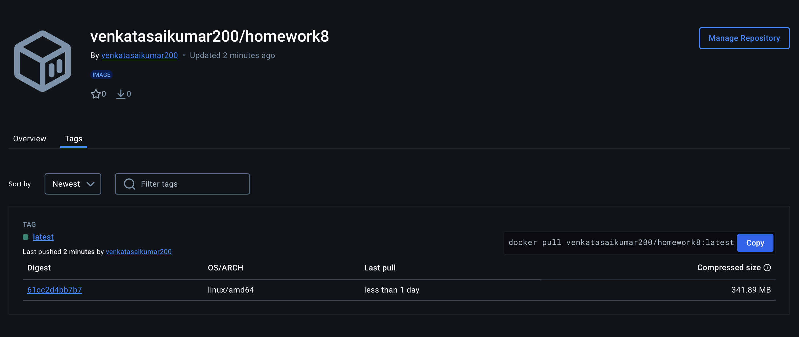
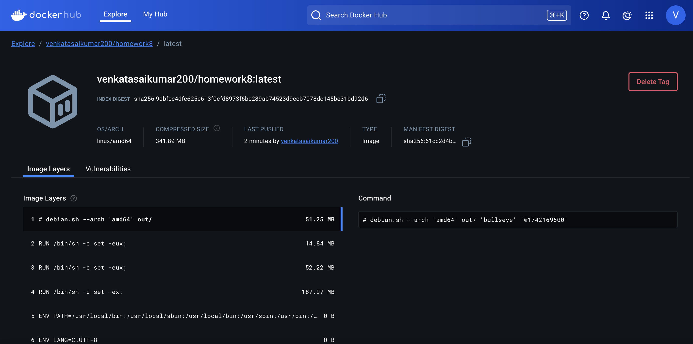

# Homework-8: QR Code Generator with Docker & GitHub Actions

This project demonstrates the use of **Docker** to build and push a Docker image that generates a QR code linking to a specific URL. The image is built using **GitHub Actions** and pushed to **Docker Hub**.

## Overview

The application generates a QR code image that links to a specified URL. This is implemented in Python and packaged inside a Docker container, allowing for easy deployment and sharing via Docker Hub.

### Docker Images in my account , homework8 repository

